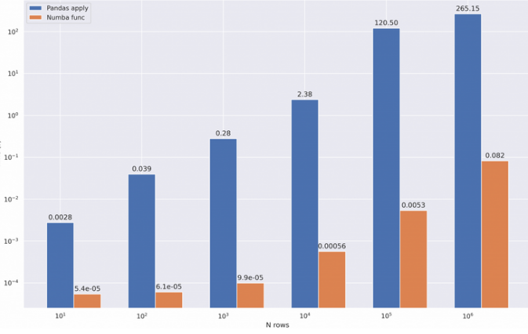
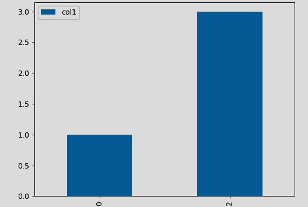
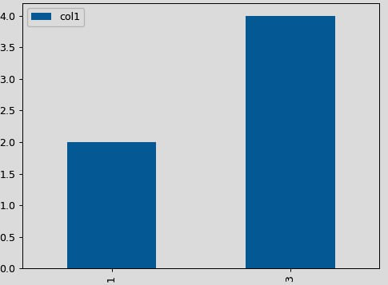
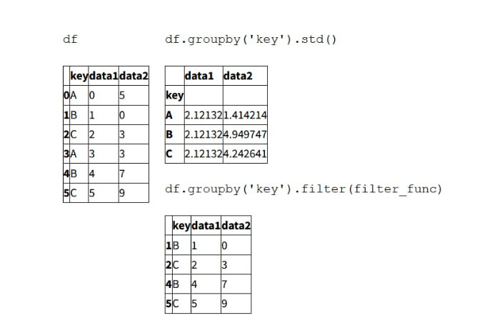
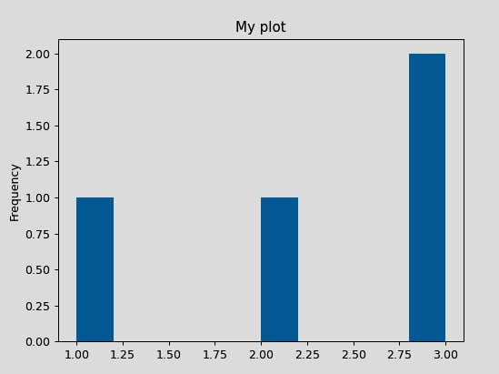

# Манипуляции с Pandas
# для анализа данных

---

## Как Pandas рисует таблицы?
\_\_repr\_\_(), _repr_html_(), _repr_latex_(), ...

---

## Считываем данные
```python
import numpy as np
import pandas as pd

data = pd.read_csv('some_data.csv')
data.head() #по умолчанию 5 строк
```
Однако всегда ли хорошо загружать данные целиком?...

--

Загрузка данных чанками:
```python[|6]
chunk = pd.read_csv('some_data.csv', chunksize = 1000)

first = chunk.get_chunk()
second = chunk.get_chunk()

type(chunk) #TextFileReader
```

---

## Оптимизация типов данных

Pandas далеко не всегда загружает данные в подходящем 
нам формате.

--
## astype()
```python
df['col1'] = df['col1'].astype(int)
df[['col1', 'col2']].astype(int)
df.astype({'col1': int, 'col2': int, 'col3': float})
```
--
## to_numeric()
```python
df['col'] = pd.to_numeric(df['col'], errors = 'coerce')
```
--

Если много повторяющихся значений, category может сэкономить память:
```python
df['category_column'] = df['category_column'].astype('category')
```
Если много разреженных типов, можем использовать SparseArray:
```python
df['sparse_column'] = pd.arrays.SparseArray(df['dense_column'])
```

---

## Ускоряем операции в Pandas

Для этой задачи мы рассмотрим 2 инструмента: __Numba__ & __Cython__.

---

## Numba
Представляет собой JIT-компилятор, переводит подмножество операций Python и NumPy в машинный код
через LLVM, с помощью пакета llvmlite.

--
## Пример использования

```python3[|2,9-11]
import pandas as pd
import numba
#100.000 rows, 4 columns
df = pd.DataFrame(np.random.randint(0,100,size=(100000, 4)),columns=['a', 'b', 'c', 'd'])

def add_new_col(x):
    return x * 5

@numba.vectorize
def add_new_col_numba(x):
    return x * 5
```
--

## Результаты выполнения
```python[|2,6,10]
In [1]: %timeit df['new_col'] = df['a'].apply(multiply)
23.9 ms ± 1.93 ms per loop (mean ± std. dev. of 7 runs, 10 loops each)

# Pandas
In [2]: %timeit df['new_col'] = df['a'] * 5
545 µs ± 21.4 µs per loop (mean ± std. dev. of 7 runs, 1000 loops each)

# numba
In [3]: %timeit df['new_col'] = multiply_numba(df['a'].to_numpy())
329 µs ± 2.37 µs per loop (mean ± std. dev. of 7 runs, 1000 loops each)
```
--
Pandas не сильно отстал от Numba, поэтому давайте заставим его это сделать.

```python
def square_mean(row):
    row = np.power(row, 2)
    return np.mean(row)

df['new_col'] = df.apply(square_mean, axis=1)
```

--

```python
@numba.njit
def square_mean_numba(arr):
    res = np.empty(arr.shape[0])
    arr = np.power(arr, 2)
    for i in range(arr.shape[0]):
        res[i] = np.mean(arr[i])
    return res

df['new_col'] = square_mean_numba(df.to_numpy())
```

---
## Pandas vs. Numba


---
## Cython
Рассмотрим пример функции на классическом Python'е
```python
def f(x):
return x * (x - 1)

def integrate_f(a, b, N):
    s = 0
    dx = (b - a) / N
    for i in range(N):
        s += f(a + i * dx)
       return s * dx

# 84 ms +- 1.01 ms per loop (mean +- std. dev. of 7 runs, 10 loops each)
```

--
## Теперь посмотрим на код с Cython
```python
def f_plain(x):
    return x * (x - 1)
def integrate_f_plain(a, b, N):
    s = 0
    dx = (b - a) / N
    for i in range(N):
        s += f_plain(a + i * dx)
    return s * dx

# 47.2 ms +- 366 us per loop (mean +- std. dev. of 7 runs, 10 loops each)
```
---

## Индексация: loc, iloc, at, iat 

---
## loc, iloc

Индексация по локальному / фактическому индексам. Пригождается при выборе
__ряда значений__:

<div class="eq_blocks">
<div class="left">

```python
mydict = [{'a': 1, 'b': 2, 'c': 3, 'd': 4},
        {'a': 100, 'b': 200, 'c': 300, 'd': 400},
        {'a': 1000, 'b': 2000, 'c': 3000, 'd': 4000}]

df = pd.DataFrame(mydict)

print(df.iloc[0])
print(type(df.iloc[0])) # 2

# 2: Series
```
</div>

<div class="right">

```python
df = pd.DataFrame([[1, 2], [4, 5], [7, 8]],
        index=['cobra', 'viper', 'sidewinder'],
        columns=['max_speed', 'shield'])

print(df.loc['viper'])

#>>> df.loc['viper']
#    max_speed    4
#    shield       5
#    Name: viper, dtype: int64
```

</div>
</div>

---

## at, iat
Индексация по локальному / фактическому индексам. Пригождается при выборе
__одного значения__:
<div class="eq_blocks">
<div class="left">

```python
df = pd.DataFrame([[0, 2, 3], [0, 4, 1], [10, 20, 30]],
                  index=[4, 5, 6], columns=['A', 'B', 'C'])
df
# >>  A   B   C
# 4   0   2   3
# 5   0   4   1
# 6  10  20  30

df.at[4, 'B']
# >> 2
df.loc[4].at['B']
# >> 2
```
</div>
<div class="right">

```python
df = pd.DataFrame([[0, 2, 3], [0, 4, 1], [10, 20, 30]],
                  columns=['A', 'B', 'C'])

df
# >>  A   B   C
# 0   0   2   3
# 1   0   4   1
# 2  10  20  30

df.iat[1, 2]

# >> 1

```
---
## MultiIndex
Объект MultiIndex позволяет воспроизвести более сложные конструкции, например:
```python
index = [('California', 2000), ('California', 2010),
         ('New York', 2000), ('New York', 2010),
         ('Texas', 2000), ('Texas', 2010)]
         
populations = [33871648, 37253956,
               18976457, 19378102,
               20851820, 25145561]

data = pd.Series(populations, index=index)
index = pd.MultiIndex.from_tuples(index)
data = data.reindex(index)
data
```

--

```python
>> California  2000    33871648
               2010    37253956
   New York    2000    18976457
               2010    19378102
   Texas       2000    20851820
               2010    25145561
   dtype: int64


data_df = data.unstack()
print(data_df)
```
---
## NA в Pandas... так ли страшно?
Давайте рассмотрим 2 схемы, по которым могут определяться NA.

--
## С помощью маскирования
В случае маскирования, сама маска представляет собой булевый массив, или же может присваивать бит в представлении данных там, где их нет (для локального указания нулевого статуса значения).

--
## Sentinels
В сигнальном методе применяется специальное значение для обозначения отсутствующей даты (например, -9999 для int или любой другой, более сложный паттерн).

--
## Теперь возвращаемся к пандам
Способ, которым Pandas обрабатывает отсутствующие значения, ограничен его зависимостью от пакета NumPy, который не имеет встроенного понятия значений NA для типов данных, не являющихся точками с плавающей запятой.

--
## None & np.nan
При попытке проитерироваться на объекте, содержащем __None__ - пользователь получит ошибку. __np.nan__ же 
в свою очередь работает как вирус:
<div class="eq_blocks">
<div class="left">

```python
arr = np.array([np.nan, 2, 3, 4])
arr.min(), arr.max(), arr.sum()
# np.nan, np.nan, np.nan
```
</div>
<div class="right">

```python[|2|3]
arr = np.array([np.nan, 2, 3, 4])
arr.nanmin(), arr.nanmax(), arr.nansum()
#2, 4, 9
```
--
Обратите внимание на следующий каст:

```python[|5|7, 9|11]
x = pd.Series(range(2), dtype=int)
x
>>0    0
  1    1
  dtype: int64

x[0] = None
x
>> 0    NaN
   1    1.0
   dtype: float64
```
---
## Базовая обработка NA
```python[|8-15]
data = pd.Series([1, np.nan, 'hello', None])
data.isnull()
#>> 0    False
#   1     True
#   2    False
#   3     True
#   dtype: bool
data[data.notnull()]
#>>  0        1
#    2    hello
#    dtype: object 
data.dropna()
#>> 0        1
#   2    hello
#   dtype: object
```
---
## Слияние и конкатенация
```python3
ser1 = pd.Series(['A' , 'B' , 'C' ], index=[1, 2, 3])
ser2 = pd.Series(['D' , 'E' , 'F' ], index=[4, 5, 6])
pd.concat([ser1, ser2])
```

--
## Merge: варианты
При попытке объединить данные мы можем столкнуться с тремя основными случаями: __один к одному__,
__многие к одному__ и __многие к многим__.

--
## Merge: один к одному
 

--
## Merge: многие к одному


--
## Merge: многие к многим


---
## GroupBy


--
На объекте GroupBy можно проитерироваться:
```python
for (method, group) in planets.groupby('method'):
    print("{0:30s} shape = {1}".format(method, group.shape))
```

--
Также вкратце затронем визуазилацию с GroupBy:
```python
df = pd.DataFrame({'col1': [1, 2, 3, 4], 'col2': ['A', 'B', 'A', 'B']})

plot = df.groupby('col2').plot(kind='bar')
```

--
GroupBy: визуализация.
<div class="eq_blocks">
<div class="left">


</div>

<div class="right">

</div>

</div>


---
## Редактирование существующих данных
Иногда приходится создавать новые данные на основе уже существующих. В этом нам помогут следующие методы:

---
## Apply
Apply метод позволяет применить функцию к столбцу. Функция может быть как предопределённая, так и объявленная вручную.

--
```python
def plus_five(x):
    return x + 5

df['new_col'] = df['existing_col'].apply(plus_five)
```


---
## Filter
Позволяет "дропнуть" дату, опираясь на заданный критерий. Для примера, давайте оставим строки с std > 4:
--
```python
def filter_func(x):
    return x['data2'].std() > 4

data1 = df.groupby('key').std()
result = df.groupby('key').filter(filter_func)
```

--


--
## Нужно больше фильтров!
```python
df = pd.DataFrame(np.array(([1, 2, 3], [4, 5, 6])), index = ['mouse', 'rabbit'],
                  columns = ['one', 'two', 'three'])

df.filter(items=['one', 'three'])
df.filter(regex='e$', axis=1) #re.search(regex, label) == True
df.filter(like='bbi', axis=0)
```
---
## Transform
Для примера сразу рассмотрим трансформацию, при которой мы из каждого вычитаем среднее всего датасета.

--
```python
df.groupby('key').transform(lambda x: x - x.mean())
```

---
## Визуализация данных
Pandas способен "из коробки" визуализировать необходимые данные. Это удобно, когда нам необходим график "на скорую руку".

--
## plot(kind='hist')
<div class="eq_blocks">
<div class="left">

```python
ser = pd.Series([1, 2, 3, 3])
plot = ser.plot(kind='hist', title='My plot')
```
</div>
<div class="right">

</div>
</div>

--
## Можно рисовать и другое
По умолчанию, функция plot использует __matplotlib__.

---
## Всем спасибо за внимание!


<style>
.eq_blocks {
	padding: 1em;
	display: flex;
	flex-direction: row;
	gap: 1rem;
	align-items: center;
	justify-content: center;
}

.left, .right {
	min-width: 480px;
}

.arrow {
	width: 82px !important;
	min-width: 82px;
	height: 61px;
}

.slides {
	width: 1280px !important;
}
</style>